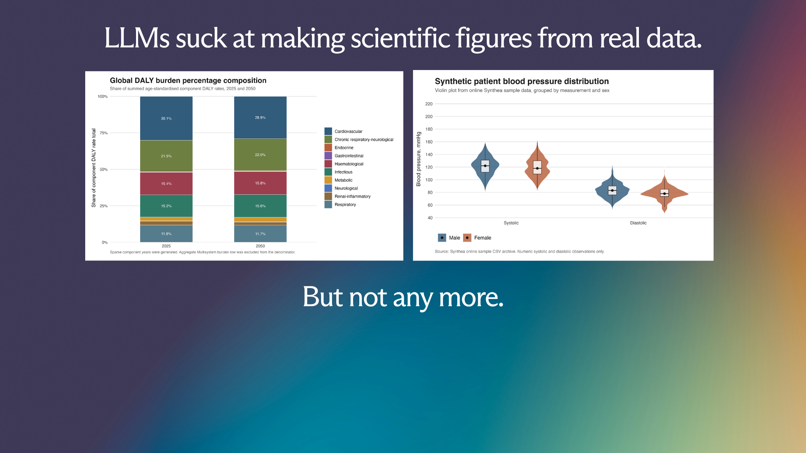
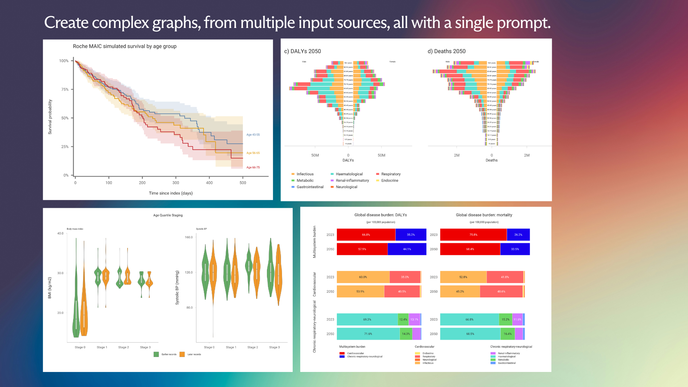
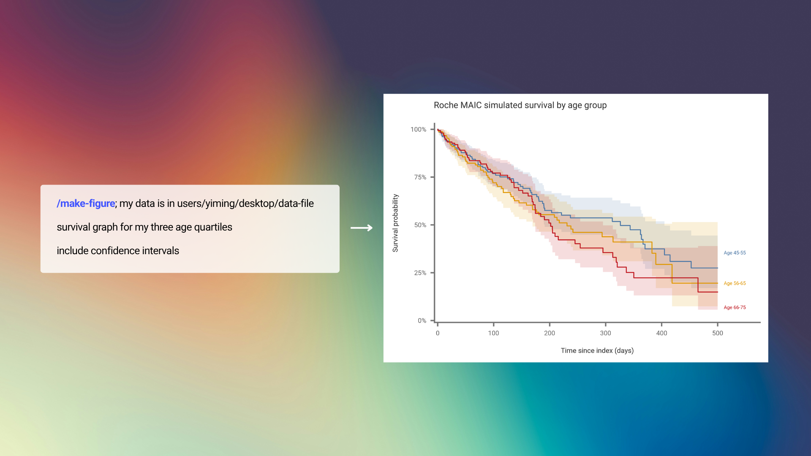
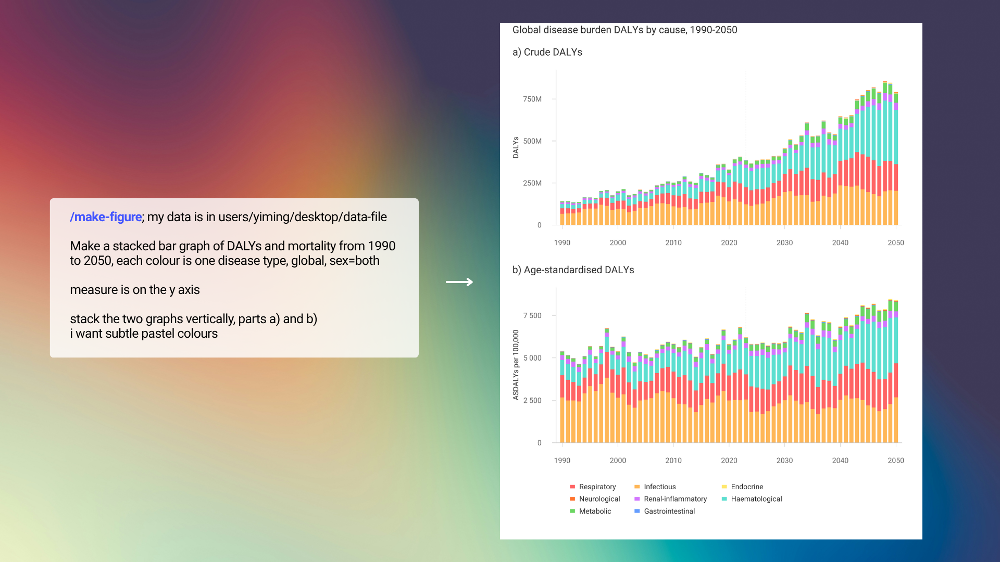
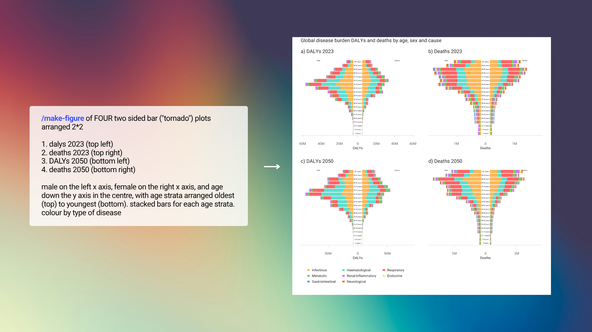
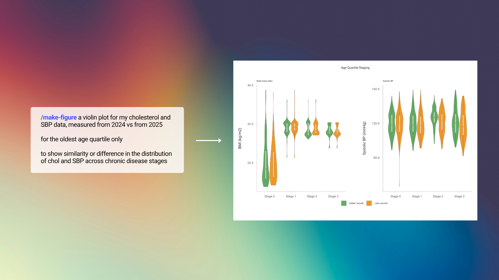
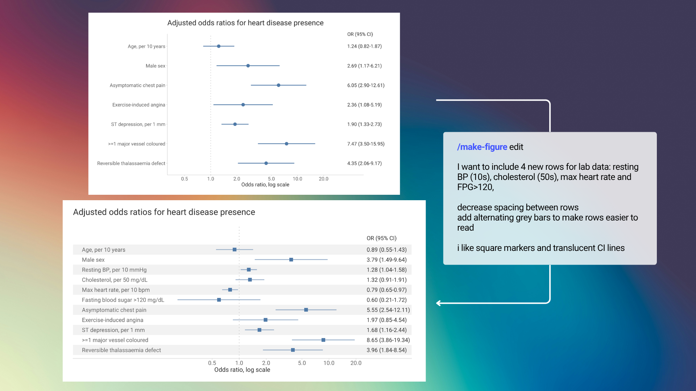
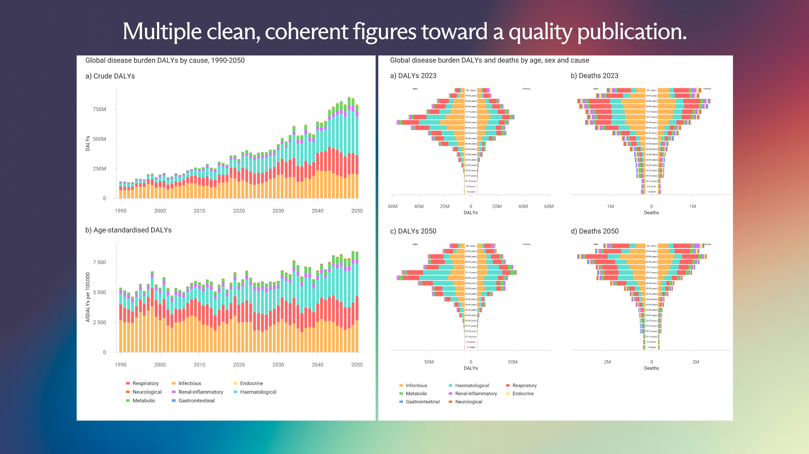
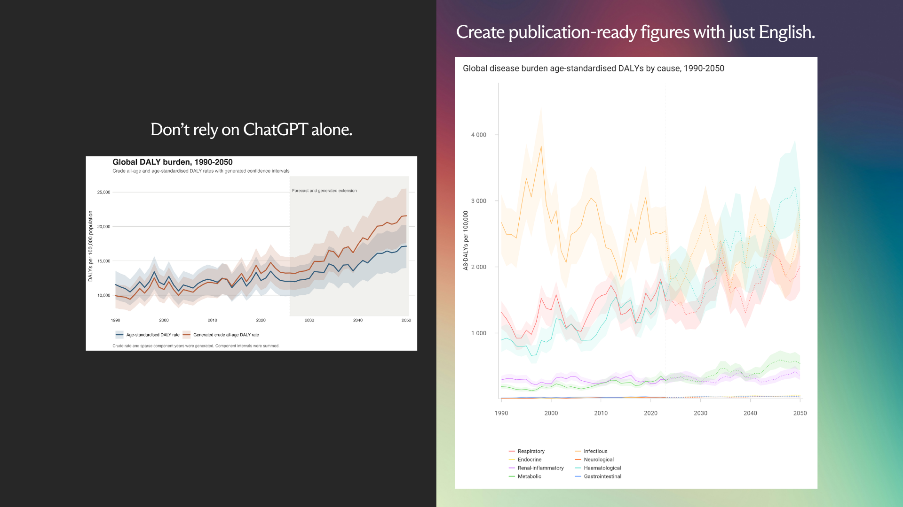

<p align="center">
  
</p>

# Welcome to autograph

A guided agentic workflow for generating publication-quality academic figures with R without coding. It gives an LLM a structured figure-generation process, visual and structural guidelines, and a thorough quality-checking protocol for creating, editing and refining figure files using R (.PNG outputs).

All data represented in figures is deterministic, originating from your source data files and called through R.

Let your team spend more time on science and less on wrangling code.

<p align="center">
  
</p>

## How To Use

Once installed, use Autograph through the installed `make-figure` skill. The two main commands are:

1. `/make-figure`, for creating a new figure.
2. `/make-figure edit`, for revising an existing figure R script or export PNG.

New to R? Autograph installs all required R dependencies needed automatically on first run.

### Figure Creation is Simple

Use `/make-figure` when you want to create a new figure. Give the agent:

When you start a new session, give the agent:
1. The input directory containing your data (as a pathname, or a file).
2. The desired output folder (you may suggest a project or folder name too) in which Autograph creates two folders:
```text
./fig-dhs-output-main-dir/
./fig-dhs-activesessions-dir/
```
For each figure, provide:
1. The graph type (line graph, forest plot, bar graph, percentage-change graph, age-sex graph, choropleth map, heatmap, etc)
2. Variables. Be as detailed as possible. Nevertheless, Autograph can infer filters or variables that are not directly provided based on context, but specify this to the user after output.
3. Any other style constraints.

### Write as you are; Autograph figures out the rest

<p align="center">
  
</p>

```text
/make-figure; my data is in users/yiming/desktop/data-file
survival graph for my three age quartiles
```

### Robust plots with minimal guidance

<p align="center">
  
</p>

```text
/make-figure; my data is in users/yiming/desktop/data-file
Make a stacked bar graph of DALYs and mortality from 1990 to 2050, each colour is one disease type, global, sex=both
measure is on the y axis
stack the two graphs vertically, parts a) and b)
i want subtle pastel colours
```

### Understands complex graph types without code

<p align="center">
  
</p>

```text
/make-figure of FOUR two sided bar ("tornado") plots arranged 2*2
1. dalys 2023 (top left)
2. deaths 2023 (top right)
3. DALYs 2050 (bottom left)
4. deaths 2050 (bottom right)
male on the left x axis, female on the right x axis, and age down the y axis in the centre, with age strata arranged oldest (top) to youngest (bottom). stacked bars for each age strata. colour by type of disease
```

### Create multi-panel figures with ease

<p align="center">
  
</p>

```text
/make-figure a violin plot for my cholesterol and SBP data, measured from 2024 vs from 2025
for the oldest age quartile only
to show similarity or difference in the distribution of chol and SBP across chronic disease stages
```

### Edit your figures by talking to Autograph

Use `/make-figure edit` when a figure already exists and you want to revise it. The edit command should point to the existing R script, PNG, or session output folder whenever possible.

Good edit requests specify:

1. The input directory used for the figure.
2. The existing R script path, PNG path, or output folder.
3. The exact visual or data change requested.
4. Whether the change should preserve the current figure type and data filters.

Autograph edits the same figure-specific R script, writes the next versioned output folder, copies forward unchanged PNGs when needed, and visually checks that the requested edit is actually visible.

If the target script or PNG cannot be identified, Autograph will stop and ask you to point to the figure that should be edited.

```text
/make-figure edit
I want to include 4 new rows for lab data: resting BP (10s), cholesterol (50s), max heart rate and FPG>120, 
decrease spacing between rows
add alternating grey bars to make rows easier to read
i like square markers and translucent CI lines
```

<p align="center">
  
</p>

## Extensive colour, structure, quality assurance guidelines

Autograph uses three bundled reference files during figure creation. The house-style guide defines graph-specific structure, including axis treatment, panel spacing, hierarchy, legends, labels, titles, export sizing, and when to use line graphs, forest plots, stacked bars, tornado plots, maps, and heatmaps. The colour guide gives semantic palette rules, so colours are chosen for meaning and readability rather than decoration. The checking guide defines the visual QA pass used after export.

The workflow is iterative. Autograph first identifies the graph type, reads the input data, writes an R script, exports a PNG, then inspects the rendered image. It checks for clipped content, overlap, missing units, weak labels, poor hierarchy, inconsistent colour mapping, crowded legends, broken time-series structure, and unbalanced panels. If the figure fails QA, Autograph edits the same R script and exports a new versioned PNG folder. This repeats until the final figure is visually readable, structurally faithful to the data, and ready for manuscript use.

<p align="center">
  
</p>

## Installation For AI Agents

If a user asks an AI agent to install this repo, the agent should:

1. Clone or download this GitHub repository.
2. Run the installer script:

```bash
bash scripts/install.sh
```

3. If the user specifies a host, pass the relevant flag:

```bash
bash scripts/install.sh --codex
bash scripts/install.sh --claude
bash scripts/install.sh --all
```

4. Use `--dry-run` to preview the install and `--validate-only` to check packaged files:

```bash
bash scripts/install.sh --all --dry-run
bash scripts/install.sh --all --validate-only
```

5. Restart the host agent application if it only discovers skills at launch.
6. Confirm that R is available.
7. Run a first test using the synthetic example data in `examples/minimal-data/`.

Do not move files out of the skill folder during installation. The workflow resolves bundled references relative to `SKILL.md`.

## Installation For Codex

Recommended:

```bash
bash scripts/install.sh --codex
```

Manual fallback:

```bash
mkdir -p "${CODEX_HOME:-$HOME/.codex}/skills"
cp -R .codex/skills/make-figure "${CODEX_HOME:-$HOME/.codex}/skills/make-figure"
```

Restart Codex after copying the skill.

## Installation For Claude Code

Recommended:

```bash
bash scripts/install.sh --claude
```

Manual fallback:

```bash
mkdir -p "${CLAUDE_HOME:-$HOME/.claude}/skills"
cp -R .claude/skills/make-figure "${CLAUDE_HOME:-$HOME/.claude}/skills/make-figure"
```

Restart Claude Code after copying the skill.

## R Dependencies

On first use, the skill checks core R package availability before rendering a figure. If core packages are missing, the workflow installs the missing core packages with the bundled installer script.

Minimum expected dependencies:

1. R
2. `ggplot2`
3. `patchwork`
4. `scales`
5. `data.table`

Common optional dependencies for more advanced figures:

1. `ggrepel`
2. `showtext`
3. `sysfonts`
4. `sf`
5. `rnaturalearth`
6. `ragg`
7. `magick`
8. `png`
9. `ggthemes`
10. `stringr`

Install the core R packages with:

```r
install.packages(c("ggplot2", "patchwork", "scales", "data.table"))
```

Install the extended set with:

```r
install.packages(c(
  "ggplot2", "patchwork", "scales", "data.table", "ggrepel",
  "showtext", "sysfonts", "sf", "rnaturalearth", "ragg",
  "magick", "png", "ggthemes", "stringr"
))
```

Some spatial and image packages may need system libraries depending on the operating system.

Check the current machine manually with:

```bash
Rscript scripts/check_r_setup.R --install-command
```

Preview package installation without installing anything:

```bash
Rscript scripts/install_r_dependencies.R --core --dry-run
```

Install missing core packages manually:

```bash
Rscript scripts/install_r_dependencies.R --core
```

Install selected optional packages only when a requested figure needs them:

```bash
Rscript scripts/install_r_dependencies.R --packages ggrepel,showtext,sysfonts
```

## Synthetic Example Data

The files in `examples/minimal-data/` are fully synthetic. The values were invented de novo for workflow testing. They are not patient data, do not represent real GBD estimates, and were not copied or derived from GBD or any public dataset.

The example data support:

1. Annual line graphs and time-series plots for every year from 2000 to 2025.
2. Annual stacked bar graphs for every year from 2000 to 2025.
3. Dot plots and forest plots, with subgroup estimates in both 2000 and 2025.
4. Percentage-change graphs from 2000 to 2025.

See `examples/example-briefs.md` for ready-to-use test prompts.

## Repository Notes

Generated figure outputs, active sessions, local R artefacts, and operating-system metadata should not be committed. The `.gitignore` file excludes these by default.

## Licence

This repository uses the MIT Licence. See `LICENSE`.

## What Is Included

```text
autograph-scientific-figures/
  .codex/
    skills/
      make-figure/
        SKILL.md
        agents/
          openai.yaml
        references/
        scripts/
          check_r_setup.R
          install_r_dependencies.R
  .claude/
    skills/
      make-figure/
        SKILL.md
        references/
        scripts/
          check_r_setup.R
          install_r_dependencies.R
  SKILL.md
  README.md
  LICENSE
  .gitignore
  references/
    figure_house_style_guidelines.md
    core-colour-guidelines.md
    checking-function.md
  examples/
    minimal-data/
      burden_timeseries.csv
      component_composition.csv
      percentage_change.csv
      subgroup_estimates.csv
    example-briefs.md
  docs/
    images-autograph/
      editexp1.png
      exp1.png
      exp2.png
      exp3.png
      exp4.png
      img1.png
      img2.png
      img3.png
      img4.png
  scripts/
    check_r_setup.R
    install.sh
    install_codex_skill.py
    install_claude_skill.py
    install_r_dependencies.R
  tests/
    test_minimal_data.py
    test_packaging.py
    test_r_dependency_scripts.py
  DESCRIPTION
```

<p align="center">
  
</p>
